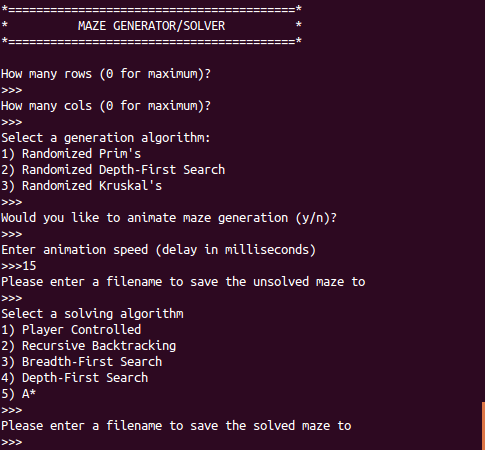
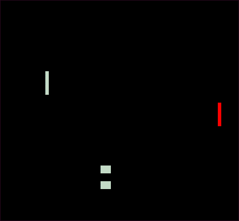
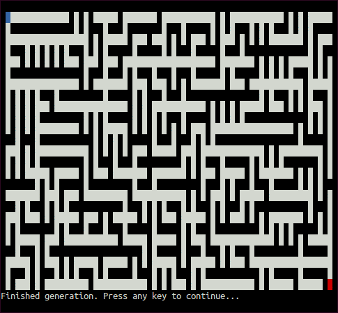
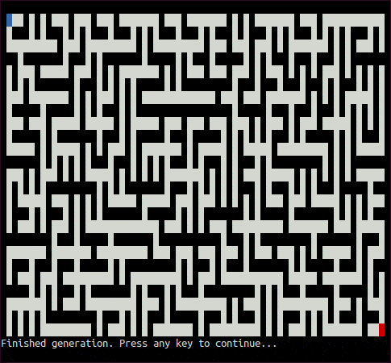
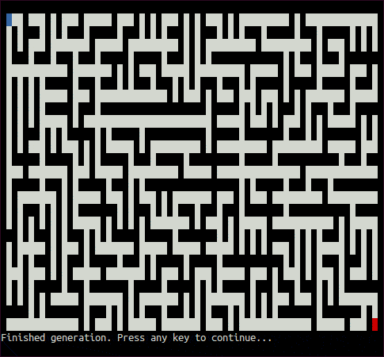

# Mazes
The maze project is a fun and interactive means of experimenting with and
demonstrating knowledge of graphing algorithms and their use cases. Using
ncurses, the maze project acts a visualizer for how graphing algorithms can be
used in the generation and solving of mazes.

## Getting Started
The following will get the project ready to run on your local machine.

### Requirements
In order to run the maze program, you will need the following:
* Python (at least 3.4)
* ncurses (readily available on most Linux Distros)

### Installation and Use
To use the maze program, simply clone it from this repo
``` bash
git clone git@github.com:ian-howell/Mazes.git
```

Once you have the project on your machine, you can build it with
``` bash
make
```

This will generate 2 binaries: `generator_driver` and `solver_driver`. These
binaries _can_ be used independently, but it's easier to simply run the python
script titled `maze.py`, which will guide you through their use.
``` bash
python3 maze.py
```

## About
The maze project is capable of generating mazes using 3 different algorithms:
* Randomized Prim's
* Randomized Depth-First Search
* Randomized Kruskal's

There are 4 automated solving algorithms:
* Recursive Backtracking
* Breadth-First Search
* Depth-First Search
* A\*

There is also a 5th option for solving; using the arrow keys, the user can
attempt to navigate through the maze manually.

The following details the machinations of each algorithm.

### Randomized Prim's
[Prim's Algorithm](https://en.wikipedia.org/wiki/Prim%27s_algorithm) is a
graphing algorithm used to find [Minimum Spanning Trees
(MST)](https://en.wikipedia.org/wiki/Minimum_spanning_tree). The algorithm
starts by picking a given node in the graph, with which it begins the MST. It
then finds the shortest edge from the MST to a node that is _not_ in the MST,
and adds that node. It continues this process until all nodes are in the MST.
The process of finding the shortest edge can be (and frequently is) optimized
by using a [Priority Queue](https://en.wikipedia.org/wiki/Priority_queue).

If we consider the console to be a fully connected graph, then we can slightly
modify this algorithm to create randomized mazes. Since the distance from a
node will always be `1`, we aren't able to pick the shortest edge (nor do we
want to). Instead, we will just randomly choose one of the edges that touches
the MST. This will result in a slowly spreading algorithm which will eventually
cut a complete maze from the grid. One of the properties of an MST is that
there are no cycles, therefore mazes generated with Prim's Algorithm with not
have loops.

<p align="center">
  
</p>

### Randomized Depth-First Search
[Depth-First Search (DFS)](https://en.wikipedia.org/wiki/Depth-first_search) is
a algorithm normally used to traverse the nodes in a graph. Like Prim's
Algorithm, it is initialized with a starting point. DFS then pushes all of the
connecting nodes on top of a
[stack](https://en.wikipedia.org/wiki/Stack_(abstract_data_type)). It then pops
off the top node from the stack, adds _its_ connecting nodes, and then repeats
the process until there are no more nodes on the stack. Normally, DFS will use
a uniform process when adding neighbors to the stack (For example, it might add
neighbors in a clockwise pattern: top, right, bottom, left). In the case of
maze generating, we need an element of randomness, so the neighbors will be
randomly selected to be added to the stack.

If we again consider the console to be a fully corrected graph, we can send DFS
through the grid, turning each visited node into a part of the maze. Due to the
nature of the stack data structure, DFS will seem to run along a path until it
runs out of space, at which point it will backtrack to an earlier point, then
run until it hits another dead-end. This will cause mazes to have very long
corridors, and a very low branching factor, so DFS mazes tend to have long
paths to the finish, but the solution is very easy to find.

<p align="center">
  
</p>

### Randomized Kruskal's Algorithm
<p align="center">
  
</p>

### Breadth-First Search
<p align="center">
  
</p>

### Depth-First Search
<p align="center">
  
</p>

### A\*
<p align="center">
  
</p>
